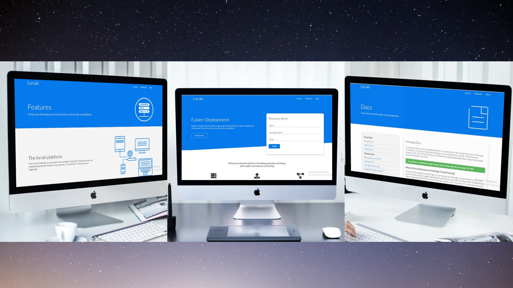

<h3 align="center">Cloud Hosting</h3>

## 

---

## 🧐 About 

This website containes multiple pages about cloud hosting. Also it's fully responsive.

Basically i used animation in home page as well as 3D type cards for the attractive looks of website.

### Prerequisites

- no required so much tools

## ⛏️ Built Using 

- HTML5

- CSS3

- JavaScript
